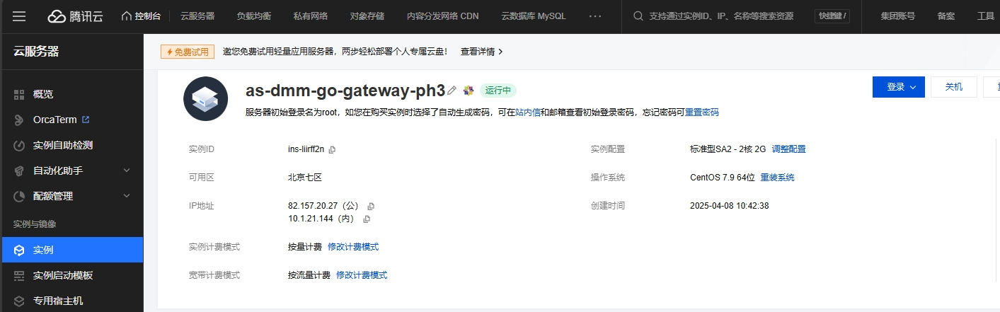
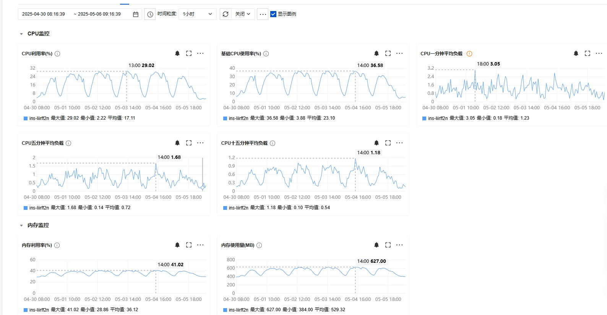
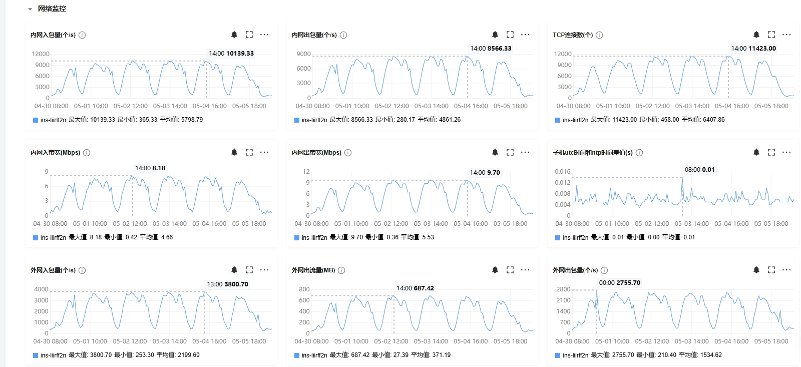

# gateway
- This gateway can forward TCP messages to the backend HTTP service.
- HTTP service can push messages to TCP connections.
## compile
1. For Windows, you need to download MSYS2 and install make.
    ```bash
    pacman -S base-devel
    ```

2. Compile dev packages
    ```bash
    make dev                # linux
    make OS=windows dev     # windows
    ```

3. Compile release and debug packages
    ```bash
    make release            # linux
    make OS=windows release # windows
    ```


## run
1. Run the dev package
    ```bash
    # Start and specify the Redis address  
    ./gateway -discovery_redis_address=127.0.0.1:6378

    # Start and specify the ports  
    ./gateway -node_info_private_http_port=18081 -node_info_public_tcp_port=18001

    # Other options
    ./gateway -h
    ```
    
2. Run the release or debug package
    
    Configure the settings as follows
    ```json
    {
        "discovery": {
            "redis_register_key": "this is key",
            "redis_address": "127.0.0.1:6739",
            "redis_password": "1234567"
        },
        "node_info": {
            "public_tcp_port": 8080,
            "private_http_port": 8081,
            "service_type": "gateway",
            "service_api_url": "http://127.0.0.1:80"
        } 
    }
    ```
    ```bash
    # Debug Environment: Add the configuration file in the COS bucket.
    ./gateway -entry_cos_file_path=middle_office/gateway/normal_test/config.json        # 测试服

    # Release Environment: Add the configuration file in the COS bucket.
    ./gateway -entry_cos_file_path=middle_office/gateway/pc/config.json                 # pc qq
    ```


## Performance


